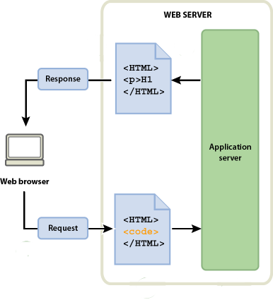

# Programación web dinámica

## Páginas web dinámicas

Las páginas web dinámicas son aquellas en las que la información presentada se genera a partir de una petición del usuario de la página.

Contrariamente a lo que ocurre con las páginas estáticas, en las que su contenido se encuentra predeterminado, en las páginas dinámicas la información aparece inmediatamente después de una solicitud echa por el usuario.

El resultado de la página obtenida en la respùesta debpenderá de varios aspectos: información guardada en la abse de datos, contenido de una cookie o sesion, parámetros en la petición HTTP,...

## Procesamiento de páginas dinámicas 

Cuando el servidor Web recibe una petición para mostrar una página dinámica, transfiere la página a un software especial encargado de finalizar la página. Este software especial se denomina **servidor de aplicaciones**.

El servidor de aplicaciones, según la petición que se ha realizado ejecuta un programa en un lenguaje de programación determinado y devuelve una respuesta HTTP, cuyo contenido normalmente es una página **HTML**. Esquemáticamente lo podemos ver de la siguiente manera:

