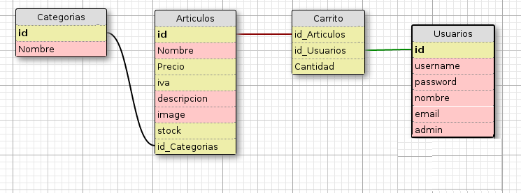

# Usando base de datos en Flask

Aunque python nos obrece diferentes módulos para conectarnos a los disintos motores de base de datos:

* mysql: [MySql-Python](https://pypi.python.org/pypi/MySQL-python), [PyMySQL](https://pypi.python.org/pypi/PyMySQL), [Mysql Conector](https://dev.mysql.com/downloads/connector/python/)
* [postgreSQL](https://wiki.postgresql.org/wiki/Python)
* [sqlite3](https://docs.python.org/2/library/sqlite3.html)

Usaremos la extensión [Flask-SQLAlchemy](http://flask-sqlalchemy.pocoo.org/2.1/) para manejar nuestra aplicación. Esta extensión provee un wrapper para el proyecto [SQLAlchemy](https://www.sqlalchemy.org/), el cual es un [Object Relational Mapper](https://es.wikipedia.org/wiki/Mapeo_objeto-relacional) o ORM.

Los ORM permiten a las aplicaciones con base de datos trabajar con objetos en vez de tablas y SQL. Las operaciones realizadas en los objetos son traducidos a comandos de base de datos transparente para el ORM. Por lo tanto se abstrae el gestor de base de datos utilizado, si cambiamos de SGBD no tendremos que cambiar nuestra aplicación. De este modo, por ejemplo, podemos estar trabajando con sqlite3 en nuestro entorno de desarrollo, y con una base de datos PostgreSQL en nuetro entorno de producción.

## Nuestra aplicación: "Mini" tienda virtual

A parir de esta unidad vamos a desarrollar una aplicación Web con todos los elementos que hemos aprendido en las unidades anteriores, las características de nuetra aplicación van a ser las siguientes:

* Vamos a crear una "mini" tienda virtual donde se van a vender artículos (en nutro ejemplo serán videojuegos). Cada artículo pertenece a una categoria.
* A nuestra tienda virtual se pueden dar de alta nuestro clientes.
* Existe un usario administrador que puede dar de alta, modificar o eliminar los artículos de la tienda.
* Caundo un usuario compra un artículo se guarad en un "carro de la compra". El carro de la compra no lo vamos a guardar en una tabla de la base de datos, vamos a utilizar cookies para guardar dicha información.
* Los usuarios pueden acceder a la tienda para realziar las compras, vamos a utilizar sesiones para similar la persistencia de la conexión.

## El modelo de base de datos

Los datos que guardamos en nuestra base de datos serán representados por una colección de clases que son referidas como modelos de base de datos. La capa ORM hará las traducciones necesarias y convertirá los objetos creados a partir de estas clases  a filas en la base de datos.

Veamos el modelo de datos que vamos a implementar:

